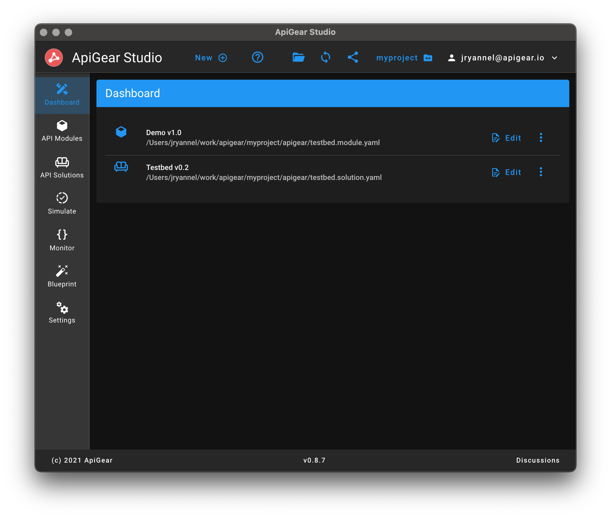
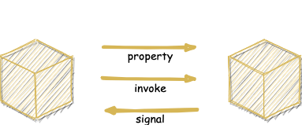

# [ObjectAPI Specification](/guide/specification.html)

<code-group>
<code-block title="ObjectAPI">
```yaml
schema: objectapi.modules/1.0
interfaces:
  - name: Counter
    properties:
      - name: count
        type: int
    operations:
      - name: increment
      - name: decrement
```
</code-block>

<code-block title="C++">
```cpp
class Counter {
public:
    virtual ~Counter();

    int count() const = 0;
    void setCount(int count) = 0;

    void increment() = 0;
    void decrement() = 0;
};
```
</code-block>

<code-block title="Python">
```py
class Counter {
    def __init__(self):
        self.count = 0

    def increment():
        raise NotImplementedError()

    def decrement():
        raise NotImplementedError()
```
</code-block>


<code-block title="TypeScript">
```ts
interface Counter {
    count: int

    increment(): void
    decrement(): void

}
```
</code-block>

<code-block title="Go">
```go
interface Counter {
    count() int
    setCount(v int)

    increment() error
    decrement() error
}
```
</code-block>

<code-block title="Qt5">
```cpp
class AbstractCounter extend QObject {
    Q_PROPERTY(int count READ count WRITE setCount NOTIFY countChanged)
public:
    virtual ~Counter(QObject* parent);

    int count() const = 0;
    void setCount(int count) = 0;

    void increment() = 0;
    void decrement() = 0;
signals:
    void countChanged(int count);
};
```
</code-block>


</code-group>

# [ApiGear Studio](https://apigear.io)

<div class="hero">
  <p class="description">The one stop shop to manage your ObjectAPIs</p>
</div>



<template>
  <div v-if="$frontmatter.features2 && $frontmatter.features2.length" class="features">
    <div v-for="(feature, index) in $frontmatter.features2" :key="index" class="feature">
      <h2>{{ feature.title }}</h2>
      <p>{{ feature.details }}</p>
    </div>
  </div>
</template>

# [ObjectLink Protocol](https://objectlinkprotocol.net)

<div class="hero">
  <p class="description">Link Objects over WebSockets</p>
  
</div>

<template>
  <div v-if="$frontmatter.features3 && $frontmatter.features3.length" class="features">
    <div v-for="(feature, index) in $frontmatter.features3" :key="index" class="feature">
      <h2>{{ feature.title }}</h2>
      <p>{{ feature.details }}</p>
    </div>
  </div>
</template>


